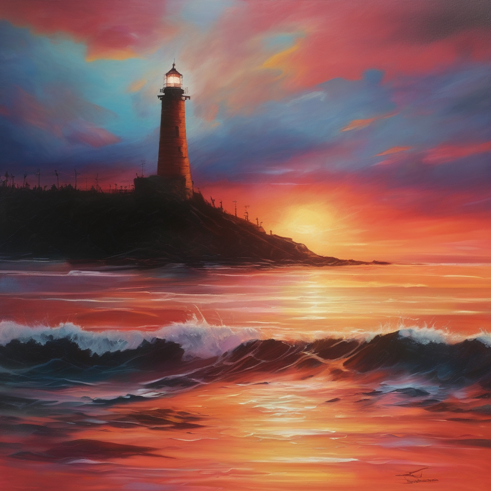
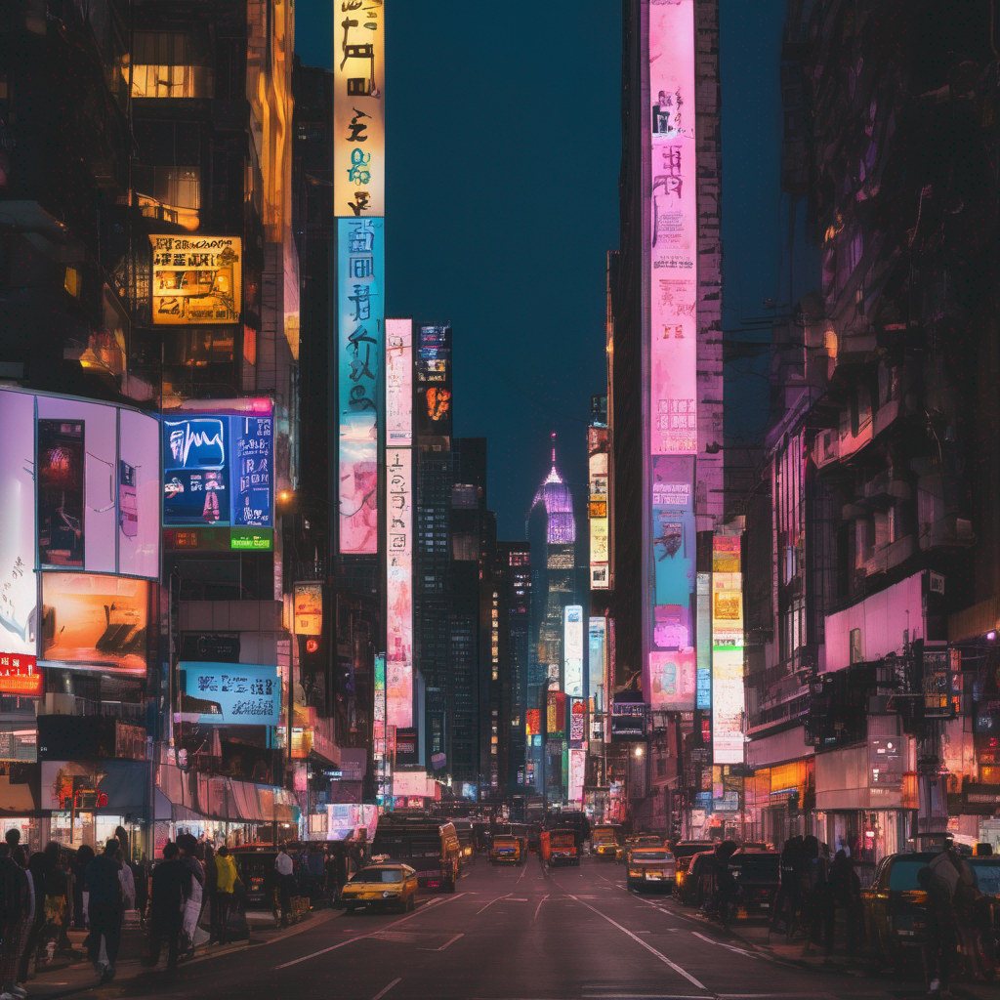
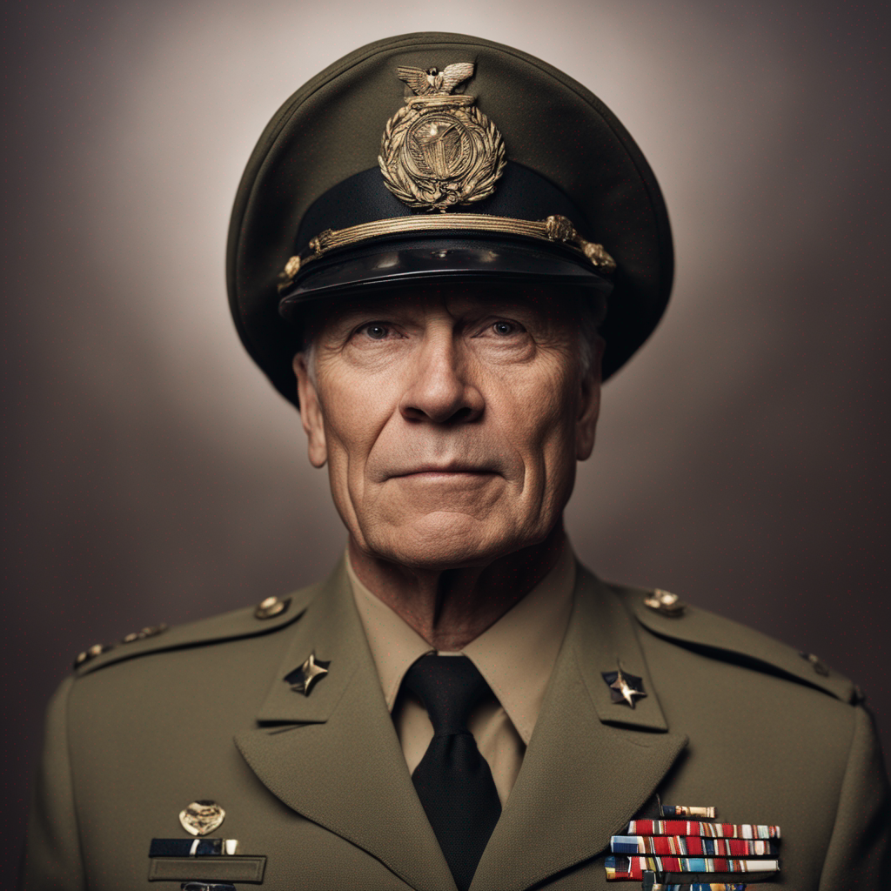
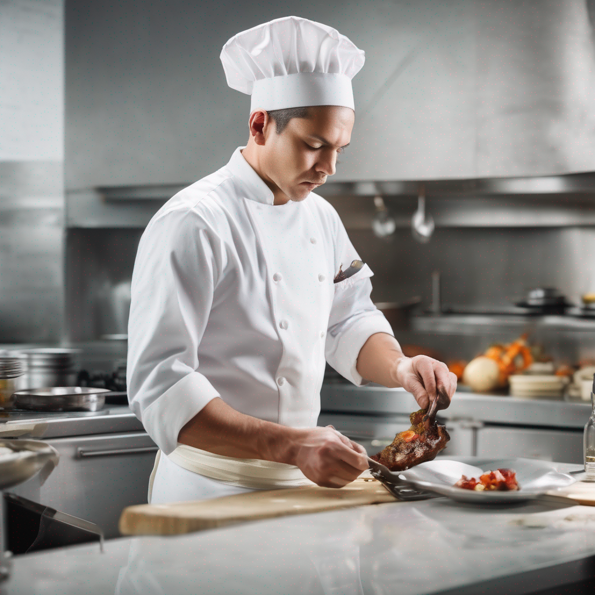
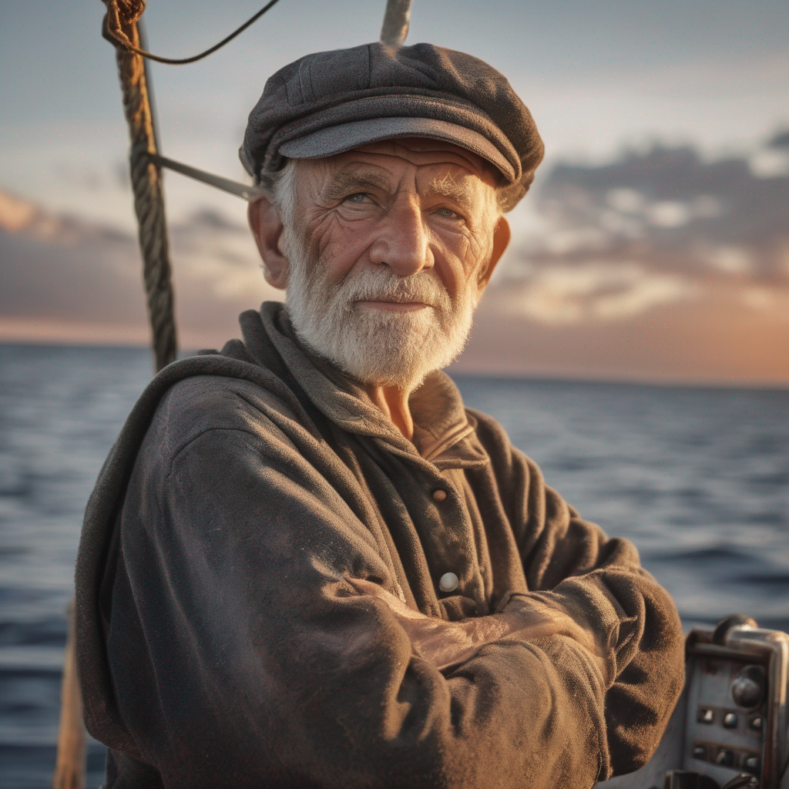
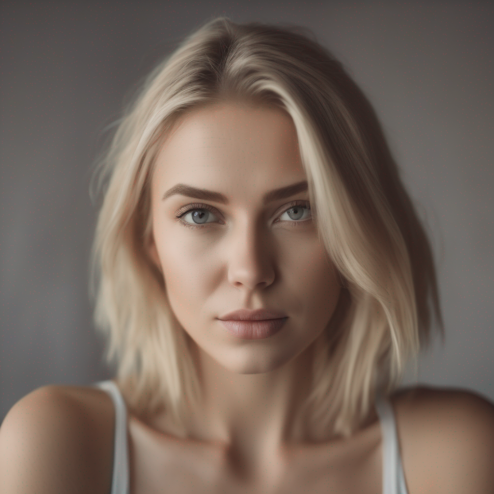
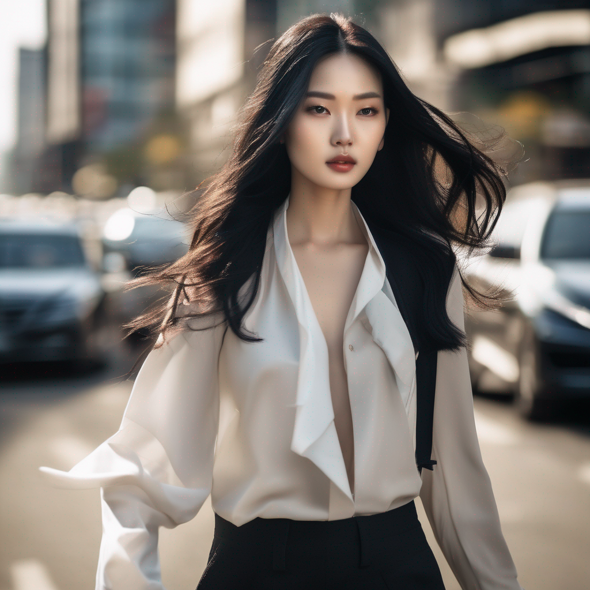
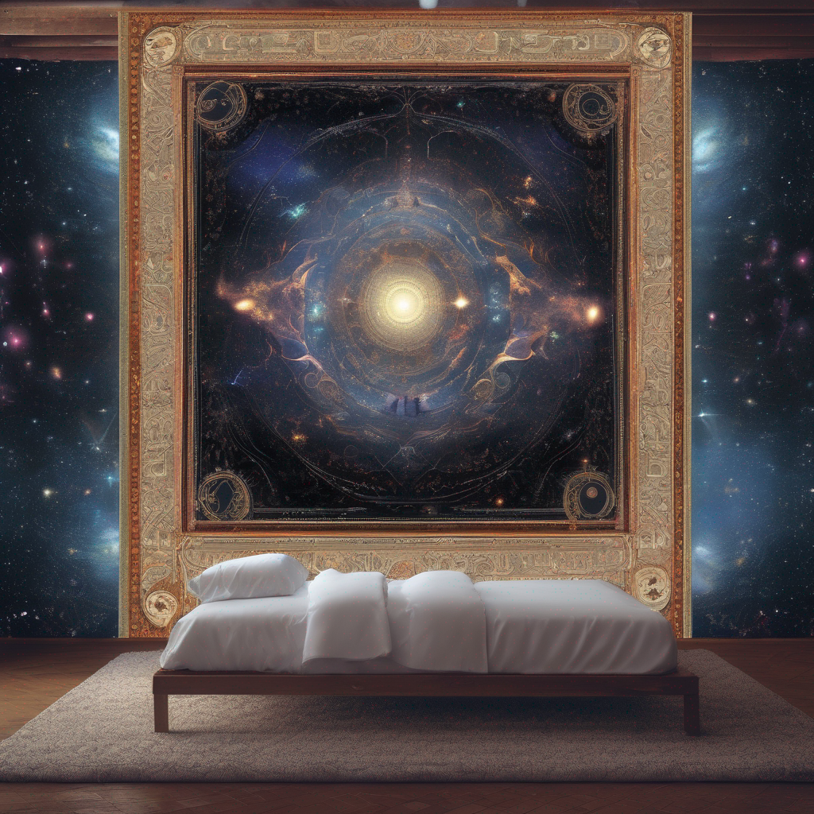
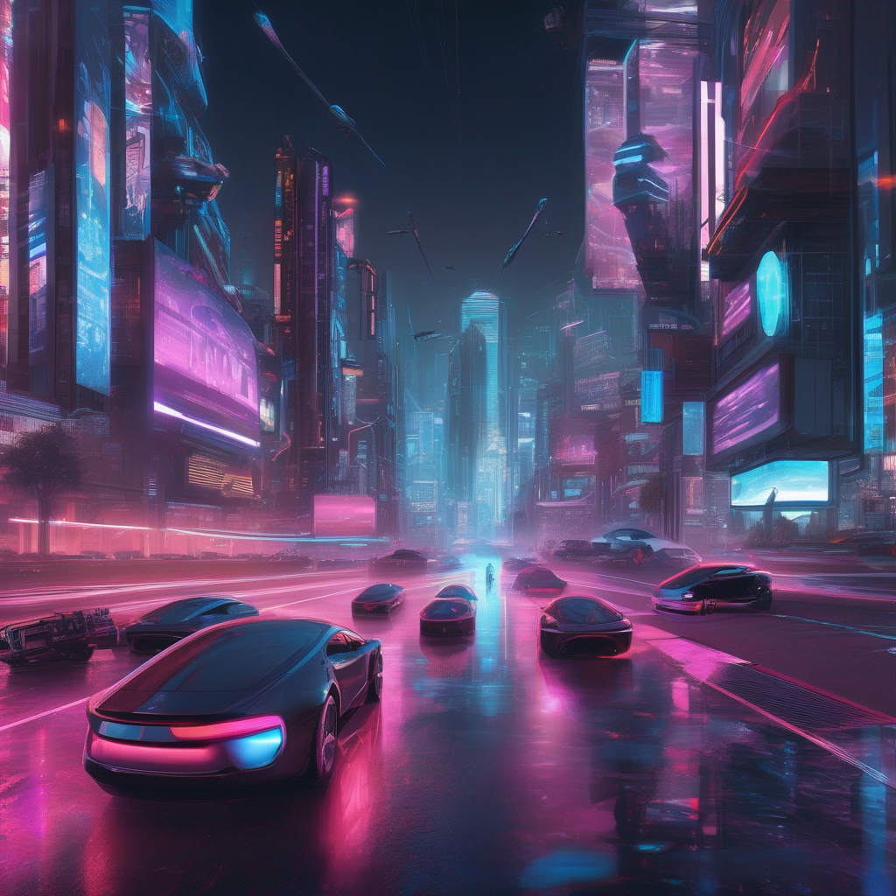
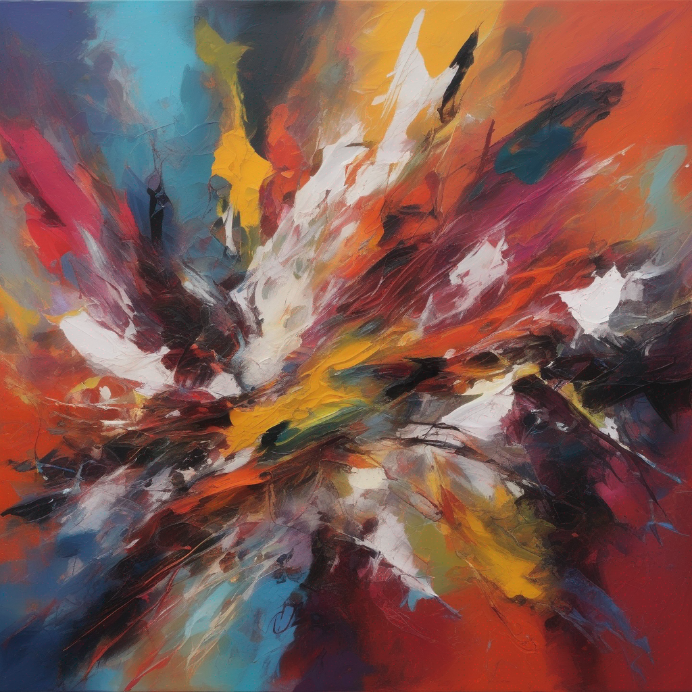

# Artistic Image Generation with Diffusion Models
Generated Images:
1:

2:

3:

4:


5:


6:


7:


8:


9:


10:

for more AI Generated Images Visit:
https://drive.google.com/drive/folders/17VKI-hVLllkxd2wwXBhFEdgS3tb1b41y?usp=sharing

## Overview

This project demonstrates how to create artistic images using diffusion models. It utilizes the "diffusers" library along with the "transformers," "accelerate," and "safetensors" libraries to generate high-quality images based on textual prompts.

## Project Description

This project aims to showcase the capabilities of diffusion models for generating artistic images. By providing textual prompts, the model creates images that correspond to the descriptions in the prompts. It uses a pre-trained model for image generation, allowing you to experiment with various prompts to generate different styles of artwork.

## How to Use

1. **Setup Environment:**
   - Ensure you have Python installed.
   - Install the required libraries using pip:

   ```bash
   pip install invisible_watermark transformers accelerate safetensors
   ```

2. **Run the Code:**
   - Open and run the Jupyter Notebook or Python script provided in this repository.
   - You can try different prompts by changing the text in the code.
   
3. **Generate Artwork:**
   - After running the code with your desired prompt, the model will generate artwork and display it.

4. **Create Artwork Grids:**
   - The project provides a function to create grids of images based on your prompts.

5. **Customization:**
   - You can modify and customize the code for your specific needs, including trying different models or fine-tuning them.

## Example Prompts

You can experiment with various prompts to generate different types of artwork:

- "Portrait of a child playing in a park, using natural lighting and candid expressions"
- "Sci-fi illustration of a futuristic city on a distant planet, with floating skyscrapers and advanced technology"
- "Abstract expressionist painting with bold, vibrant colors and dynamic brushstrokes, conveying energy and emotion"


## Acknowledgments

This project leverages the power of diffusion models, transformers, and other open-source libraries. We would like to thank the community for their contributions.
